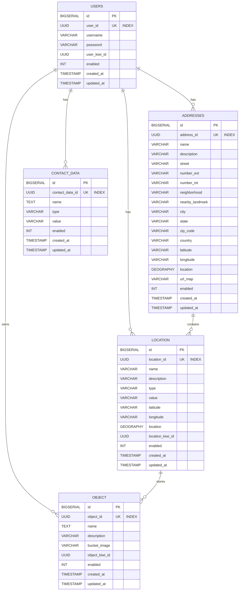

# HouseDB

Sera un proyecto en cual tiene como objetivo ayudar a las personas/usuarios a encontrar en su hogar los objetos que necesitan, para esto se tendrá una base de datos con los objetos y sus respectivas categorías, el usuario podrá buscar por categoría o por nombre del objeto, también se tendrá una sección de favoritos donde el usuario podrá guardar los objetos que le interesen. El plus de esto es también ayudarles a recordar que tienen los objetos necesarios para cierta actividad, ejemplo: una persona dirá ire de día campo y el sistema le mencionara dónde esta su mochila, casa de campaña, etc. Esto se apoyara de servicios de LLM para generar las respuestas a las preguntas de los usuarios, también se tendrá una sección de favoritos donde el usuario podrá guardar los objetos que le interesen.

## Estructura del repositorio
- backend/java
- db
- db/sql
- db/make
- helm/housedb-backend
- LICENSE
- Makefile
- README.md
- script

## Stack
- Java 21
- PostgreSQL
- Flyway
- Podman
- Maven (Maven Wrapper)

### Backend Java

El backend será en Java sin frameworks, utilizando la biblioteca estándar de java puedes tener un ejemplo de este otro repositorio mio: https://github.com/rafex/kiwi/tree/main/backend/java
Será solo una API REST separando las cosas en capas:
- housedb-bootstrap
- housedb-common
- housedb-core
- housedb-infra-postgres
- housedb-ports
- housedb-tools
- housedb-transport-grpc
- housedb-transport-jetty
- housedb-transport-rabbitmq
- Makefile (para compilar, testear, etc)

### Database

Habrá que crear una base de datos que estará montada en PostgreSQL y administrada por Flyway, utiliza de ejemplo lo que hice en otro proyecto: https://github.com/rafex/kiwi/tree/main/db
Recuerda que usaremos el sistema Kiwi donde se almacenaran los objetos y aquí crear las tablas necesarias para el objetivo de HouseDB

### Deploy

Usaremos Dockerfile para crear la imagen necesaria y se desplegara en mi k3s con helm revisa los ejemplos de este otro repositorio mio: https://github.com/rafex/kiwi/tree/main/helm/kiwi-backend y https://github.com/rafex/kiwi/tree/main/backend/java

